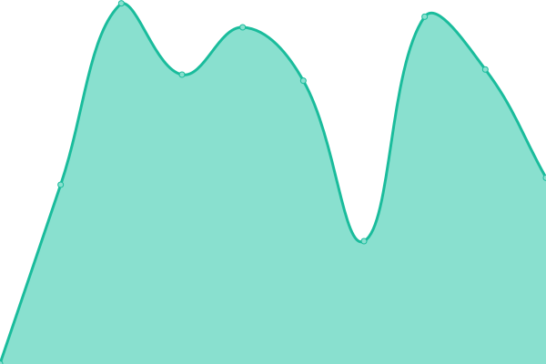

# [📈 Live Status](https://Modern-Modpacks.github.io/mm-upptime): <!--live status--> **🟩 All systems operational**

This repository contains the open-source uptime monitor and status page for [Modern Modpacks](https://modernmodpacks.site), powered by [Upptime](https://github.com/upptime/upptime).

With [Upptime](https://upptime.js.org), you can get your own unlimited and free uptime monitor and status page, powered entirely by a GitHub repository. We use [Issues](https://github.com/Modern-Modpacks/mm-upptime/issues) as incident reports, [Actions](https://github.com/Modern-Modpacks/mm-upptime/actions) as uptime monitors, and [Pages](https://Modern-Modpacks.github.io/mm-upptime) for the status page.

<!--start: status pages-->
<!-- This summary is generated by Upptime (https://github.com/upptime/upptime) -->
<!-- Do not edit this manually, your changes will be overwritten -->
<!-- prettier-ignore -->
| URL | Status | History | Response Time | Uptime |
| --- | ------ | ------- | ------------- | ------ |
|  [MissingTexture](https://missingtexture.modernmodpacks.site) | 🟩 Up | [missing-texture.yml](https://github.com/Modern-Modpacks/mm-upptime/commits/HEAD/history/missing-texture.yml) | 

 486ms
     
 | 

<a href="https://status.modernmodpacks.site/history/missing-texture">99.46%</a>
    

|  [KJSPKG Statistics (Automatin')](https://tizudev.vercel.app/automatin/api/1025316079226064966/kjspkg) | 🟩 Up | [kjspkg-statistics-automatin.yml](https://github.com/Modern-Modpacks/mm-upptime/commits/HEAD/history/kjspkg-statistics-automatin.yml) | 

 912ms
     
 | 

<a href="https://status.modernmodpacks.site/history/kjspkg-statistics-automatin">99.58%</a>
    

|  [ThisRecipeDoesNotExist](https://thisrecipedoesnotexist.modernmodpacks.site) | 🟩 Up | [this-recipe-does-not-exist.yml](https://github.com/Modern-Modpacks/mm-upptime/commits/HEAD/history/this-recipe-does-not-exist.yml) | 

 1275ms
     
 | 

<a href="https://status.modernmodpacks.site/history/this-recipe-does-not-exist">99.29%</a>
    

|  [Splashes](https://splashes.modernmodpacks.site) | 🟩 Up | [splashes.yml](https://github.com/Modern-Modpacks/mm-upptime/commits/HEAD/history/splashes.yml) | 

 731ms
     
 | 

<a href="https://status.modernmodpacks.site/history/splashes">99.28%</a>
    

<!--end: status pages-->

[**Visit our status website →**](https://Modern-Modpacks.github.io/mm-upptime)

## 📄 License

- Powered by: [Upptime](https://github.com/upptime/upptime)
- Code: [MIT](./LICENSE) © [Anand Chowdhary](https://anandchowdhary.com), supported by [Pabio](https://pabio.com)
- Data in the `./history` directory: [Open Database License](https://opendatacommons.org/licenses/odbl/1-0/)
